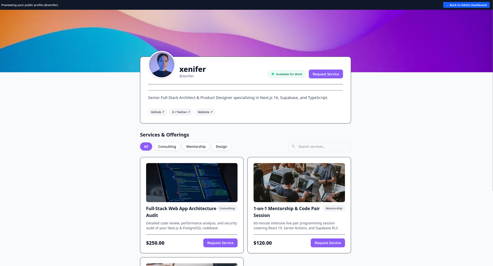
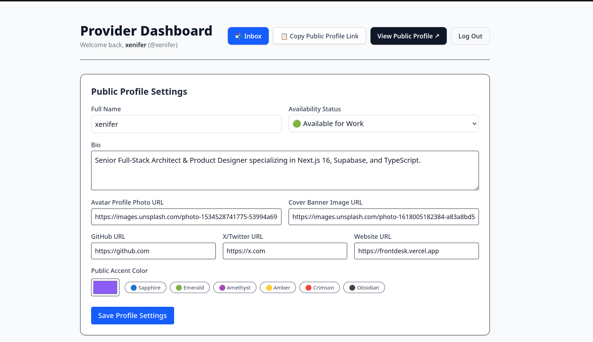
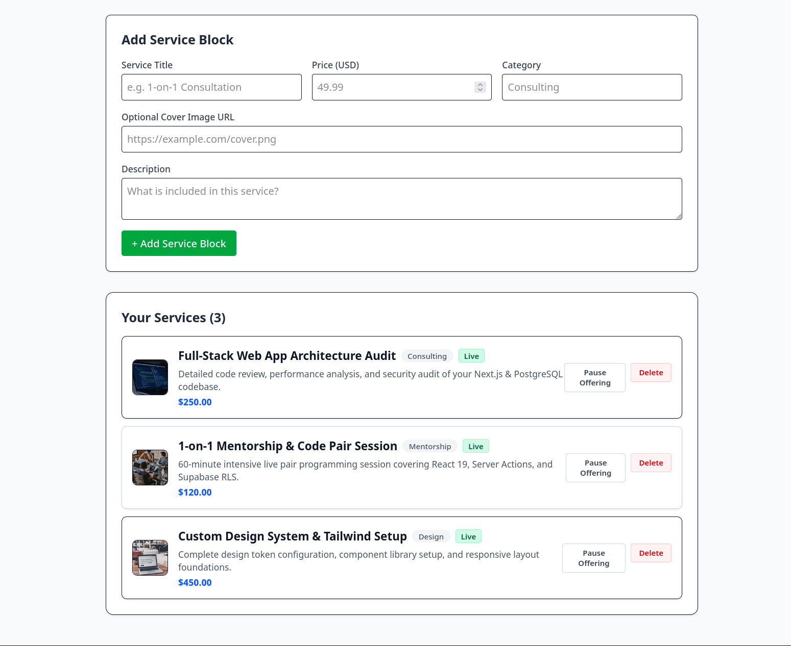

# FrontDesk

FrontDesk is a solo service provider platform built with Next.js 16 (App Router), Supabase, and Tailwind CSS. It enables freelancers, consultants, and service providers to manage real-time availability, display service blocks, and capture structured booking requests.

**🌐 Live Production Demo:** [https://frontdesk-lac.vercel.app](https://frontdesk-lac.vercel.app)  
**📰 Engineering Write-ups:** [Dev.to Article ↗](https://dev.to/shoytanbaba99/escaping-tutorial-hell-building-frontdesk-112n) · [Hashnode Post-Mortem ↗](https://hashnode.com/edit/cmsjg36hi00000aktfo0idh89)

---

## 📸 Application Showcase

### Public Provider Profile Page (`/[username]`)


### Provider Dashboard & Profile Settings (`/admin`)


### Service Block Management & Status Controls (`/admin`)


---

## 🛠️ Tech Stack

- **Framework:** Next.js 16 (App Router, React 19, Server Actions)
- **Database & Auth:** Supabase (`@supabase/ssr`, PostgreSQL, Row Level Security)
- **Rate Limiting:** Upstash Redis (`@upstash/ratelimit`, Sliding-window algorithm)
- **Styling:** Tailwind CSS (Vanilla CSS variable tokens)
- **Validation:** Zod
- **Type Safety:** TypeScript

---

## ✨ Features

- **Provider Dashboard (`/admin`):**
  - Manage live availability status (`AVAILABLE`, `BUSY`, `OFFLINE`).
  - Create, pause/activate, and delete service blocks with prices, categories, and image covers.
  - Custom profile configuration (Avatar photo URL, Cover banner URL, Bio, GitHub, X/Twitter, Website, Theme Accent Color).
  - One-click public profile link copy to clipboard.

- **Provider Inbox (`/admin/inbox`):**
  - Filter requests by status (`PENDING`, `CONTACTED`, `DECLINED`).
  - Unread inbox badge notification counter.
  - Quick action status updates and request expunge/deletion.

- **Public Profile View (`/[username]`):**
  - High-converting cover image banner and overlapping profile avatar.
  - Interactive category filter pills and live title search bar.
  - Accessible modal dialog for submitting structured service booking requests.
  - Application-level rate limiting via Upstash Redis sliding-window algorithm protecting public request submission endpoints from spam and storage bloat.

---

## 🗄️ Database Schema & RLS Setup

Run the following SQL script in your Supabase SQL Editor to set up tables and security policies:

```sql
-- 1. Create Profiles Table
CREATE TABLE IF NOT EXISTS public.profiles (
    id UUID PRIMARY KEY REFERENCES auth.users(id) ON DELETE CASCADE,
    username TEXT UNIQUE NOT NULL,
    full_name TEXT NOT NULL,
    status TEXT NOT NULL DEFAULT 'AVAILABLE',
    theme_color TEXT NOT NULL DEFAULT '#2563EB',
    bio TEXT,
    avatar_url TEXT,
    cover_image_url TEXT,
    github_url TEXT,
    x_url TEXT,
    website_url TEXT,
    created_at TIMESTAMPTZ NOT NULL DEFAULT NOW(),
    updated_at TIMESTAMPTZ NOT NULL DEFAULT NOW()
);

-- 2. Create Service Blocks Table
CREATE TABLE IF NOT EXISTS public.blocks (
    id UUID PRIMARY KEY DEFAULT gen_random_uuid(),
    user_id UUID NOT NULL REFERENCES public.profiles(id) ON DELETE CASCADE,
    title TEXT NOT NULL,
    description TEXT,
    price_cents INTEGER NOT NULL DEFAULT 0,
    category TEXT NOT NULL DEFAULT 'General',
    image_url TEXT,
    is_active BOOLEAN NOT NULL DEFAULT true,
    created_at TIMESTAMPTZ NOT NULL DEFAULT NOW(),
    updated_at TIMESTAMPTZ NOT NULL DEFAULT NOW()
);

-- 3. Create Requests Table
CREATE TABLE IF NOT EXISTS public.requests (
    id UUID PRIMARY KEY DEFAULT gen_random_uuid(),
    provider_id UUID NOT NULL REFERENCES public.profiles(id) ON DELETE CASCADE,
    block_id UUID REFERENCES public.blocks(id) ON DELETE SET NULL,
    client_name TEXT NOT NULL,
    client_email TEXT NOT NULL,
    message TEXT NOT NULL,
    status TEXT NOT NULL DEFAULT 'PENDING',
    created_at TIMESTAMPTZ NOT NULL DEFAULT NOW(),
    updated_at TIMESTAMPTZ NOT NULL DEFAULT NOW()
);

-- 4. Enable Row Level Security (RLS)
ALTER TABLE public.profiles ENABLE ROW LEVEL SECURITY;
ALTER TABLE public.blocks ENABLE ROW LEVEL SECURITY;
ALTER TABLE public.requests ENABLE ROW LEVEL SECURITY;

-- 5. RLS Policies
CREATE POLICY "Public profiles are viewable by everyone" ON public.profiles FOR SELECT USING (true);
CREATE POLICY "Users can update own profile" ON public.profiles FOR UPDATE USING (auth.uid() = id);

CREATE POLICY "Public blocks are viewable by everyone" ON public.blocks FOR SELECT USING (true);
CREATE POLICY "Users can manage own blocks" ON public.blocks FOR ALL USING (auth.uid() = user_id);

CREATE POLICY "Anyone can insert requests" ON public.requests FOR INSERT WITH CHECK (true);
CREATE POLICY "Providers can view own requests" ON public.requests FOR SELECT USING (auth.uid() = provider_id);
CREATE POLICY "Providers can update own requests" ON public.requests FOR UPDATE USING (auth.uid() = provider_id);
CREATE POLICY "Providers can delete own requests" ON public.requests FOR DELETE USING (auth.uid() = provider_id);

-- 6. Grant Permissions
GRANT DELETE ON public.requests TO authenticated;
```

---

## 🚀 Local Setup Instructions

1. **Clone the repository:**
   ```bash
   git clone https://github.com/Shoytanbaba99/frontdesk.git
   cd frontdesk
   ```

2. **Install dependencies:**
   ```bash
   npm install
   ```

3. **Configure Environment Variables:**
   Copy the example environment file:
   ```bash
   cp .env.example .env.local
   ```

   Populate `.env.local` with your Supabase and Upstash Redis credentials:
   ```env
   # Supabase Cloud Credentials
   NEXT_PUBLIC_SUPABASE_URL=https://your-project-id.supabase.co
   NEXT_PUBLIC_SUPABASE_ANON_KEY=your-supabase-anon-key

   # Upstash Redis Credentials (Rate Limiting)
   UPSTASH_REDIS_REST_URL=https://your-redis-database.upstash.io
   UPSTASH_REDIS_REST_TOKEN=your-upstash-rest-token
   ```

4. **Apply Database Migrations:**
   Using Supabase CLI or SQL Editor:
   ```bash
   # Apply migration using Supabase CLI
   npx supabase db push
   ```
   *(Or copy the SQL script from `supabase/migrations/20260808000000_init_frontdesk_schema.sql` into your Supabase SQL Editor).*

5. **Run the development server:**
   ```bash
   npm run dev
   ```

Open `http://localhost:3000` in your browser.
